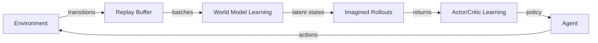
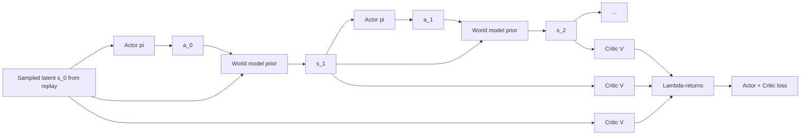

# DreamerV3 Architecture

This doc is a short visual tour of what DreamerV3 is actually doing. It's
aimed at people who have read the paper abstract and skimmed the training
loop but want a clearer mental model before touching the code.

If you want the full technical detail, read the paper:
<https://arxiv.org/abs/2301.04104>.

> The mermaid diagrams below render directly on GitHub. For standalone
> PNG versions (useful for slides or papers), run
> `python scripts/visualize_network.py` — this writes `world_model.png`,
> `imagination.png`, and `pipeline.png` into `docs/figures/`.

---

## The three nested loops

At the top level, DreamerV3 alternates between three loops.



1. **Data collection.** The agent acts in the real environment and every
   transition `(obs, action, reward, done)` is written to the replay buffer.
2. **World model learning.** Batches are sampled from replay. The world
   model is trained to reconstruct observations, rewards, and terminations
   from a compact latent state.
3. **Actor-critic learning.** Starting from those latent states, the world
   model *imagines* rollouts under the current policy, and the actor and
   critic are trained on the returns of those imagined trajectories — no
   new environment interaction required.

The ratio between (1) and (2)+(3) is controlled by `run.train_ratio`. A
train ratio of 32 means roughly 32 gradient steps × batch for every env
step.

---

## The world model (RSSM)

DreamerV3 uses a Recurrent State-Space Model (RSSM). Each timestep has a
two-part latent state:

- `h_t` — a deterministic GRU hidden state carrying long-horizon info.
- `z_t` — a stochastic categorical latent capturing per-step uncertainty.

```mermaid
flowchart TB
    subgraph t-1[Step t-1]
        h1[h_{t-1}]
        z1[z_{t-1}]
    end
    subgraph t[Step t]
        h2[h_t]
        zprior[z_t prior]
        zpost[z_t posterior]
    end

    a[action a_{t-1}] --> GRU
    h1 --> GRU
    z1 --> GRU
    GRU --> h2

    h2 -->|prior MLP| zprior
    obs[observation o_t] --> ENC[Encoder]
    ENC --> xt[x_t]
    h2 --> zpost
    xt --> zpost

    zpost --> DEC[Decoder] --> ohat[o_t hat]
    zpost --> RWD[Reward head] --> rhat[r_t hat]
    zpost --> CONT[Continue head] --> chat[gamma_t hat]
    h2 --> DEC
    h2 --> RWD
    h2 --> CONT
```

Key points:

- **Prior vs posterior.** The prior `p(z_t | h_t)` is what the model
  predicts *without* seeing the observation. The posterior
  `q(z_t | h_t, x_t)` also conditions on the observation's embedding `x_t`.
  During training, a KL loss pulls the two together. During imagination,
  only the prior is used — this is how the model dreams forward without
  peeking at real observations.
- **Three prediction heads.** Decoder (reconstructs `o_t`), reward head
  (predicts `r_t`), and continue head (predicts `1 - done_t`).
- **Symlog + two-hot.** Rewards and values are predicted as two-hot
  distributions over symlog-transformed targets. This is what lets a single
  set of hyperparameters span Atari-sized rewards and DMC-sized rewards.

---

## Imagination and actor-critic learning

Once the world model is trained, the actor-critic sees *only* latent
states. It never touches pixels.



- The **actor** is trained to maximize λ-returns of imagined rollouts
  (length = `imag_horizon`, default 15).
- The **critic** is trained by regression onto the same λ-returns.
- Entropy regularization on the actor keeps exploration alive.
- Gradients flow back through the world model's latent dynamics — the
  actor learns *through* the model, not just from scalar rewards.

---

## Where to find it in code

If you want to map these diagrams onto the upstream implementation at
<https://github.com/danijar/dreamerv3>:

| Concept               | Roughly lives in                           |
|-----------------------|--------------------------------------------|
| Encoder / Decoder     | `dreamerv3/nets.py` (`SimpleEncoder`, `SimpleDecoder`) |
| RSSM                  | `dreamerv3/rssm.py`                        |
| Symlog / two-hot      | `dreamerv3/jaxutils.py`                    |
| Actor / Critic        | `dreamerv3/agent.py`                       |
| Imagination rollout   | `dreamerv3/agent.py::imagine`              |
| Training loop driver  | `dreamerv3/embodied/run/train.py`          |

File paths drift between releases — use these as starting points for
`grep`, not as fixed coordinates.
